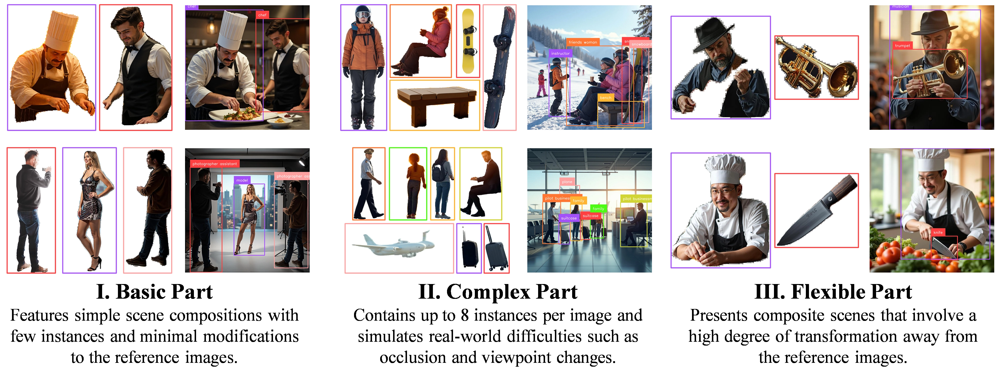

# IMIG-Dataset

## 📝 Introduction



This repository is the official implementation of the generation code for the **IMIG-Dataset** proposed in paper [**ContextGen: Contextual Layout Anchoring for Identity-Consistent Multi-Instance Generation**](https://arxiv.org/abs/2510.11000). The IMIG-Dataset is a large-scale, structured dataset designed for identity-consistent **I**mage-guided **M**ulti-**I**nstance **G**eneration tasks, featuring progressive difficulty levels. The main repository for the paper is at [here](https://github.com/nenhang/ContextGen).

## 🛠️ Setup

In our implementation, we use [FLUX family](https://github.com/black-forest-labs/flux), [DreamO](https://github.com/bytedance/DreamO) and [MOSAIC](https://github.com/bytedance-fanqie-ai/MOSAIC) as image generation models, [GroundingDINO](https://github.com/IDEA-Research/GroundingDINO) and [DeRIS](https://github.com/Dmmm1997/DeRIS) as object detection and segmentation tools. For these tools requires a much older version of CUDA and PyTorch, while those image generation models require newer ones. Therefore, we are supposed to set up two independent conda environments.

> Note: Environment setup for GroundingDINO and DeRIS may encounter issues. If you face any problems, please **refer to their original repositories**.

1. Create the first conda environment `imig-gen` for FLUX family and Dreamo, which requires torch ~= 2.6.

    ```bash
    conda create -n imig-gen python=3.10 -y
    conda activate imig-gen

    cd third_party/DreamO
    pip install -r requirements.txt

    pip install https://github.com/nunchaku-tech/nunchaku/releases/download/v0.3.2/nunchaku-0.3.2+torch2.6-cp310-cp310-linux_x86_64.whl

    cd ../../
    pip install -r requirements.txt
    ```

    > if you encounter issues when installing GroundingDINO using `pip install -e .`, such as `ModuleNotFoundError: No module named 'pip'`, you can try installing with `pip install -e . --no-build-isolation --config-settings editable_mode=strict`.

2. Create the second conda environment `imig-tool` for DeRIS, which requires torch ~= 2.0 and a lower CUDA version (like 11.8). You may need to switch CUDA (or NVCC) versions if you find CUDA 12+ incompatible with DeRIS.

    ```bash
    conda create -n imig-tool python=3.10 -y
    conda activate imig-tool

    pip install torch==2.0.0 torchvision==0.15.1 torchaudio==2.0.1 --index-url https://download.pytorch.org/whl/cu118

    cd third_party/GroundingDINO
    pip install -e .

    cd ../DeRIS
    pip install mmcv-full==1.7.2 -f https://download.openmmlab.com/mmcv/dist/cu118/torch2.0/index.html
    pip install -r requirements.txt
    cd deris/models/branchs/perception_branch/Mask2Former_Simplify/modeling/pixel_decoder/ops
    sh make.sh
    ```

    > If you encounter issues in `make.sh`, you may check if your python, CUDA and PyTorch versions are compatible. Higher versions are likely to cause issues.

3. Download all the pre-trained models' weights used in our code. All the download links and Huggingface URLs are provided in the [`environ_config_template.py`](./environ_config_template.py) file. After downloading, please modify the paths in `environ_config_template.py` accordingly. Then refer to [`third_party/DeRIS/README.md`](./third_party/DeRIS/README.md) to download the model weights required by DeRIS and place them under `third_party/DeRIS/pretrain_weights/` as follows:

    ```
    ├── ...
    ├── src
    └── third_party
        └── DeRIS
            ├── pretrain_weights
            │   ├── beit3_base_patch16_224.zip
            │   ├── beit3_large_patch16_224.zip
            │   ├── beit3.spm
            │   ├── model_final_f6e0f6.pkl
            │   ├── model_final_1e7f22.pkl
            │   ├── DeRIS-L-grefcoco.pth
            │   └── DeRIS-L-refcoco.pth
            ├── DreamO
            ├── ...
    ```

4. If you want to use the prompt generation feature based on DeepSeek, please register an account on [DeepSeek](https://platform.deepseek.com/api_keys) and get your API key. Then fill in the `DEEPSEEK_API_KEY` field in `environ_config_template.py`.

5. After finishing the above steps, please rename `environ_config_template.py` to `environ_config.py`:

    ```bash
    mv environ_config_template.py environ_config.py
    ```

## 🚀 Usage

> In the generation code, we provide several customized parameters for users to control the amount, style and other aspects of the generated images. You can refer to the corresponding code and comments in `src` directory for more details. Here is a brief description of how to use the code.

### Overview

For the basic and complex sub-datasets, we use the same codebase (`src/generate_dataset.py` and `src/generate_prompts.py`) with some adjustable parameters to achieve different generation effects. And for the flexible sub-dataset, we provide an example of generating images with 2-5 subjects (`src/generate_composite_dataset.py` and `src/generate_composite_prompts.py`), and you can modify the code for more subjects.

### Prompts Generation

To generate prompts for the sub-datasets, please run:

```bash
conda activate imig-gen
python src/generate_prompts.py # for basic and complex sub-datasets

python src/generate_composite_prompts.py # for flexible sub-dataset
```

For both of the scripts, you can modify the parameters in the main function to control the number of prompts, number of processes and number of prompts per API call. You can find the generated prompts examples in the `prompts` directory.

### Dataset Generation

#### Basic and Complex Sub-datasets

To generate the basic and complex sub-datasets, please run the following command:

```bash
bash ./scripts/generate_dataset.sh
```

The script will sequentially execute all the necessary steps to generate the dataset, including image generation, segmentation, annotation, filtering, etc. You may refer to the script and comments for more details about each step. It's highly recommended to check the generated results after each step to ensure the correctness and quality of the output and to avoid potential issues in later steps.

The generation code will restore scan the current generation results, so you can stop the process at any time and resume it later without losing progress.

#### Flexible Sub-dataset

To generate the sub-dataset with multiple subjects, please run the following command step by step:

```bash
bash ./scripts/generate_composite_dataset.sh
```

Similar to the previous dataset generation process, it's highly recommended to check the generated results after each step.

## 💡 Customize Your Own Generation Process

### Generation Parameters

You can modify the parameters in the main functions of `src/generate_dataset.py` and `src/generate_composite_dataset.py` to control the number of inference steps, image size, filtering thresholds, etc. There too many parameters to list here, please refer to the code and comments for more details.

### LLM Prompt Generation Templates

In `src/generate_prompts.py`, you can replace the function call of `generate_initial_prompt_2` in function `llm_prompt_generator` with `generate_initial_prompt` to generate much simpler prompts. Feel free to customize the `GENERATION_RULES` and `EXAMPLE_FORMATS` variables to create your own prompt generation templates. Check the code for more details.

### Image Models for Generation

In our approach, we all use FLUX-DiT based models for image generation. You can easily replace them with other models in the code. For example, if you want to use other cutting-edge composition models, you can implement their `load_pipeline` and `generate_composite_image` function and place them in `src/model_api` directory. Then you can replace the corresponding function import and function calls in `src/generate_composite_dataset.py` to use your own models.

### FLUX.1-Kontext Editing Templates

In `src/generate_dataset.py`, you can modify the `KONTEXT_EDIT_PROMPT_TEMPLATE` variable to customize the editing prompts and corresponding probability distribution. This template will make a significant impact on how different the edited image (used as the reference image) is from the original instance in the composite image (used as the target image). Check the code for more details.

## 📚 Citation

If you find our work useful in your research, please consider citing the following paper:

```
@article{xu2025contextgencontextuallayoutanchoring,
      title={ContextGen: Contextual Layout Anchoring for Identity-Consistent Multi-Instance Generation},
      author={Ruihang Xu and Dewei Zhou and Fan Ma and Yi Yang},
      year={2025},
      eprint={2510.11000},
      archivePrefix={arXiv},
      primaryClass={cs.CV},
      url={https://arxiv.org/abs/2510.11000},
}
```
