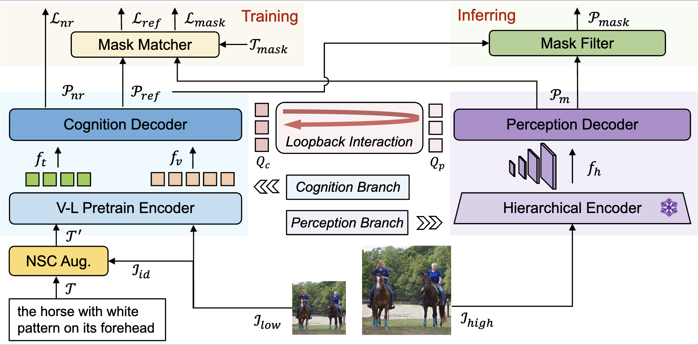

# DeRIS: Decoupling Perception and Cognition for Enhanced Referring Image Segmentation through Loopback Synergy

<a href='https://arxiv.org/pdf/2507.01738'></a>


<!-- [Ming Dai<sup>1,2</sup>](https://scholar.google.com/citations?view_op=list_works&hl=zh-CN&user=s_ZB7xkAAAAJ), Wenxuan Cheng<sup>1</sup>, [Jiang-jiang Liu<sup>2</sup>](https://scholar.google.com/citations?hl=zh-CN&user=lpFrrs8AAAAJ), [Sen Yang<sup>2</sup>](https://scholar.google.com/citations?hl=zh-CN&user=z5O3DLcAAAAJ),  [Wenxiao Cai<sup>3</sup>](https://scholar.google.com/citations?user=9K3ox0QAAAAJ&hl=zh-CN), [Yanpeng Sun<sup>4</sup>](https://scholar.google.com/citations?hl=zh-CN&user=a3FI8c4AAAAJ), [Wankou Yang<sup>1*</sup>](https://automation.seu.edu.cn/ywk/main.psp)

<sup>1</sup> Southeast University , <sup>2</sup> Baidu VIS , <sup>3</sup> Stanford , <sup>4</sup> NUS -->
 
## Updates

- **2025.07.03: The codes and models are released.**
- **2025.06.26: Our work has been accepted by ICCV 2025.**

## Abstract
Referring Image Segmentation (RIS) is a challenging task that aims to segment objects in an image based on natural language expressions. While prior works have predominantly concentrated on improving vision-language interactions and achieving fine-grained localization, a comprehensive examination of the inherent limitations in existing RIS frameworks remains underexplored. To bridge this gap, we propose DeRIS, a novel framework that decomposes RIS into two key components: perception and cognition. This modular decomposition facilitates a systematic analysis of the primary bottlenecks impeding RIS performance. Our findings reveal that the predominant limitation lies not in perceptual deficiencies, but in the insufficient multi-modal cognitive capacity of current models. To mitigate this, we propose a Loopback Interaction mechanism, which enhances the synergy between the perception and cognition modules, thereby enabling precise segmentation while simultaneously improving robust image-text comprehension. Additionally, we analyze and introduce a non-referent sample conversion data augmentation to address the long-tail distribution issue related to non-referent samples in general scenarios. Notably, DeRIS demonstrates inherent adaptability to both non- and multi-referents scenarios without requiring specialized architectural modifications, enhancing its general applicability. Extensive experiments conducted on the RefCOCO/+/g (RIS) and gRefCOCO (GRES) datasets demonstrate the superior performance of our method.

## FrameWork
<!-- [framework](./docs/framework.pdf)   -->
 

## Installation
CUDA=11.8
torch=2.0.0
torchvision=0.15.1

### Prerequisites

```bash
pip install -r requirements.txt
```


Then optionally install DeRIS package in editable mode:
```bash
pip install -e .
```

Then compiling pixel decoder CUDA operators:
```bash
cd deris/models/branchs/perception_branch/Mask2Former_Simplify/modeling/pixel_decoder/ops
sh make.sh
```

### Data Preparation

Following the data structure of the [C3VG](https://github.com/Dmmm1997/C3VG?tab=readme-ov-file#data-preparation).
Prepare the mscoco dataset, Then download the mixed annotations [here](https://seunic-my.sharepoint.cn/:u:/g/personal/230238525_seu_edu_cn/EaLwcHWBhvRLlgv17QkN3_0BGGnuKq5gMOGCMFmvFCXLbw?e=qqL3Cs) and
the grefs annotations [here](https://seunic-my.sharepoint.cn/:u:/g/personal/230238525_seu_edu_cn/EcB0nRt1gYFFnPFzOY4Zo6UB32fDANbhIA1epFzj4j9cdQ?e=YSpE0p).

The data structure should look like the following:
```
| -- data
    |--seqtr_type
        | -- annotations
            | -- mixed-seg
                | -- instances_nogoogle.json
            | -- grefs
                | -- instance.json
        | -- images
            | -- mscoco
                | -- train2014
```

### Pre-trained Weights

`DeRIS` utilizes the [BEiT-3](https://github.com/microsoft/unilm/blob/master/beit3/README.md) model as both the backbone and the multi-modality fusion module. The pre-trained weights can be downloaded from [this link](https://github.com/microsoft/unilm/blob/master/beit3/README.md#download-checkpoints). Additionally, you will need to download the [tokenizer](https://github.com/microsoft/unilm/blob/master/beit3/README.md#text-tokenizer) for BEiT-3.

First, create a directory for the pre-trained weights:

```
mkdir pretrain_weights
```
Place the BEiT checkpoints and tokenizer within this directory.

The weights for Swin-S can be downloaded from [this link](https://dl.fbaipublicfiles.com/maskformer/mask2former/coco/instance/maskformer2_swin_small_bs16_50ep/model_final_1e7f22.pkl), and the weights for Swin-B can be downloaded from [this link](https://dl.fbaipublicfiles.com/maskformer/mask2former/coco/instance/maskformer2_swin_base_384_bs16_50ep/model_final_f6e0f6.pkl).  Please place the downloaded weights into the following directory.

```
pretrain_weights
|—— beit3_base_patch16_224.zip
├── beit3_large_patch16_224.zip
├── beit3.spm
├── model_final_f6e0f6.pkl
└── model_final_1e7f22.pkl
```

The final directory structure of DeRIS should resemble the following:
```
DeRIS
|—— asserts
├── configs
├── data
├── pretrain_weights
├── deris
└── tools
```

## Demo

Here, demo for DeRIS are provided.

The following scripts can be used to test on the GRES task.
```bash
python tools/demo.py --img "asserts/imgs/Figure_1.jpg"  --expression "a pair of people and a frisbee" --config  configs/gres/DERIS-L-grefcoco.py  --checkpoint  /PATH/TO/DeRIS-L-grefcoco.pth
```

The following scripts can be used to test on the RIS task.
```bash
python tools/demo.py --img "asserts/imgs/Figure_2.jpg"  --expression "a black and brown dog walking through the ocean water" --config  configs/refcoco/DERIS-L-refcoco.py  --checkpoint  /PATH/TO/DeRIS-L-refcoco.pth
```


For loading alternative pretrained weights or adjusting threshold settings, please consult the `tools/demo.py`.


## Training

If you want to retrain the model, you can run the following scripts:
```bash
bash tools/dist_train.sh [PATH_TO_CONFIG] [GPU_NUMBER]
```


## Evaluation

If you want to reproduce the result, download it and then run the following scripts:
```bash
bash tools/dist_test.sh [PATH_TO_CONFIG] [GPU_NUMBER] --load-from [PATH_TO_CHECKPOINT_FILE]
```
### Models ZOO

#### RefCOCO
The results of DeRIS-B on RefCOCO/+/g mixed dataset are as follows:

| Split                   | mIoU   | oIoU   | MaskACC@0.5-0.9                |
|-------------------------|--------|--------|--------------------------------|
| val_refcoco_unc         | 81.99  | 80.80  | 91.24, 89.72, 87.03, 80.05, 49.88 |
| testA_refcoco_unc       | 82.97  | 82.68  | 92.88, 91.61, 89.11, 81.53, 49.49 |
| testB_refcoco_unc       | 80.14  | 78.47  | 87.93, 85.95, 83.40, 77.10, 53.18 |
| val_refcocoplus_unc     | 75.62  | 72.21  | 83.62, 81.57, 79.18, 73.26, 46.36 |
| testA_refcocoplus_unc   | 79.16  | 77.26  | 88.29, 86.85, 84.36, 77.57, 47.00 |
| testB_refcocoplus_unc   | 71.63  | 66.11  | 77.53, 75.20, 72.92, 67.48, 46.88 |
| val_refcocog_umd        | 76.30  | 73.89  | 84.15, 81.68, 77.98, 70.81, 48.53 |
| test_refcocog_umd       | 77.15  | 75.88  | 85.53, 82.64, 79.06, 72.19, 48.12 |

Download the [weight](https://seunic-my.sharepoint.cn/:u:/g/personal/230238525_seu_edu_cn/EfZNq-Wmr5dPhAfyP9Go1wABj4WTCtU_f0RFnfa3Wt1uzw?e=EIVEKf), reproduce the result using this script:
```bash
bash tools/dist_test.sh configs/refcoco/DERIS-B-refcoco.py 1 --load-from /PATH/TO/DeRIS-B-refcoco.pth
```
---

The results DeRIS-L on RefCOCO/+/g mixed dataset are as follows:

| Split                   | mIoU   | oIoU   | MaskACC@0.5-0.9                |
|-------------------------|--------|--------|--------------------------------|
| val_refcoco_unc         | 85.72  | 85.41  | 93.53, 92.40, 90.32, 84.60, 63.35 |
| testA_refcoco_unc       | 86.64  | 86.49  | 95.14, 94.14, 91.88, 86.12, 62.64 |
| testB_refcoco_unc       | 84.52  | 82.87  | 90.97, 89.38, 87.13, 83.12, 66.70 |
| val_refcocoplus_unc     | 81.28  | 79.01  | 88.45, 86.98, 85.12, 79.94, 60.23 |
| testA_refcocoplus_unc   | 83.74  | 82.34  | 91.66, 90.50, 88.51, 82.91, 60.88 |
| testB_refcocoplus_unc   | 78.59  | 74.41  | 84.11, 82.31, 80.39, 76.78, 62.13 |
| val_refcocog_umd        | 80.01  | 77.65  | 86.97, 84.70, 81.15, 74.88, 57.88 |
| test_refcocog_umd       | 81.32  | 80.12  | 88.86, 86.68, 83.19, 76.46, 59.42 |

Download the [weight](https://seunic-my.sharepoint.cn/:u:/g/personal/230238525_seu_edu_cn/EZvC21tD4yVOocjgEAocTdIBk-P_CfUU1_YIUTG7SZs20g?e=t0oh9J), reproduce the result using this script:
```bash
bash tools/dist_test.sh configs/refcoco/DERIS-L-refcoco.py 1 --load-from /PATH/TO/DeRIS-L-refcoco.pth
```
---

#### GRefCOCO

The results of DeRIS-B on gRefCOCO dataset are as follows:
| Split    | N-acc.   | gIoU   | cIoU   |
|----------|--------|--------|--------|
| val      | 77.03  | 74.10  | 68.06  |
| testA    | 75.98  | 73.72  | 71.99  |
| testB    | 63.44  | 65.63  | 64.65  |

Download the [weight](https://seunic-my.sharepoint.cn/:u:/g/personal/230238525_seu_edu_cn/EVgSTnndkd5IvYtct0_ztMsB6GWVIBsMJd48r5dIh_LIeQ?e=UWcN2l), reproduce the result using this script:
```bash
bash tools/dist_test.sh configs/gres/DERIS-B-grefcoco.py 1 --load-from /PATH/TO/DeRIS-B-grefcoco.pth  --score-threshold 0.7
```
---

The results of DeRIS-L on gRefCOCO dataset are as follows:

| Split  | N-acc.  | gIoU  | cIoU  |
|--------|-------|-------|-------|
| val    | 82.22 | 77.67 | 72.00 |
| testA  | 78.30 | 75.30 | 73.73 |
| testB  | 66.81 | 67.99 | 67.38 |

Download the [weight](https://seunic-my.sharepoint.cn/:u:/g/personal/230238525_seu_edu_cn/EVzG9iiJB4hEoC6FIjV7p8IBTJ0y8r0nmNwxQDbyNhDDYg?e=tmgJKJ), reproduce the result using this script:
```bash
bash tools/dist_test.sh configs/gres/DERIS-L-grefcoco.py 1 --load-from /PATH/TO/DeRIS-L-grefcoco.pth  --score-threshold 0.9
```

### Acknowledgements
This repository partially builds upon the codebases of [SimVG](https://github.com/Dmmm1997/SimVG/), [BEiT-3](https://github.com/microsoft/unilm/tree/master/beit3), [Mask2Former](https://github.com/facebookresearch/Mask2Former) and [SeqTR](https://github.com/seanzhuh/SeqTR).

## Citation
```
@misc{DeRIS,
      title={DeRIS: Decoupling Perception and Cognition for Enhanced Referring Image Segmentation through Loopback Synergy}, 
      author={Ming Dai and Wenxuan Cheng and Jiang-jiang Liu and Sen Yang and Wenxiao Cai and Yanpeng Sun and Wankou Yang},
      year={2025},
      eprint={2507.01738},
      archivePrefix={arXiv},
      primaryClass={cs.CV},
      url={https://arxiv.org/abs/2507.01738}, 
}
```
